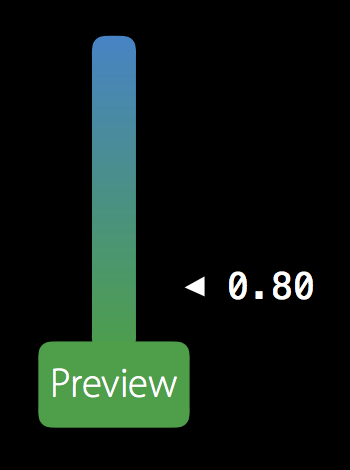
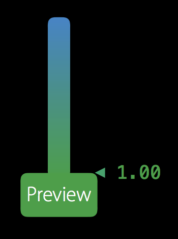
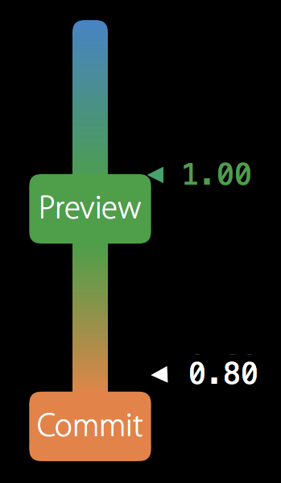
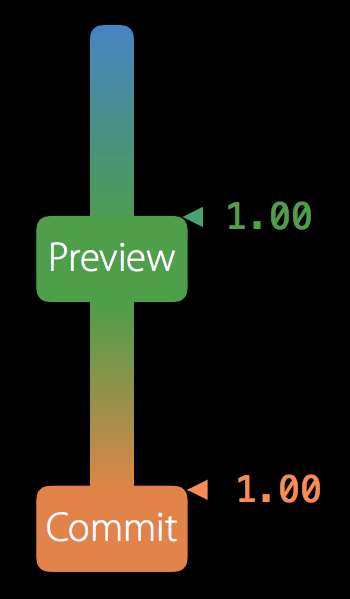

# iOS-10-PreviewInteraction

预览


在iOS 10中苹果推出了两个新的API，UIPreviewInteraction和UIPreviewInteractionDelegate

为开发者提供了自定义3D Touch来进行UI交互的方法


###UIPreviewInteractionDelegate中有四个方法，其中有两个必须实现：

```
- (void)previewInteraction:(UIPreviewInteraction *)previewInteraction
didUpdatePreviewTransition:(CGFloat)transitionProgress
                     ended:(BOOL)ended;
```
Preview阶段，相当于Peek，transitionProgress提供了一个从0.0到1.0的值，你可以利用它来控制动画过程之类的事情



当transitionProgress达到1.0时，ended为真，你可以用来完成这个阶段的Preview Interaction



```
- (void)previewInteractionDidCancel:(UIPreviewInteraction *)previewInteraction;
```
当用户放弃按压或者因为其他原因需要停止交互时（例如接到一个电话）将调用此方法，一般来说，你应该将didUpdatePreviewTransition里实现的内容在这里全部还原回去

###另外两个：
```
- (void)previewInteraction:(UIPreviewInteraction *)previewInteraction
 didUpdateCommitTransition:(CGFloat)transitionProgress
                     ended:(BOOL)ended;
```
Commit阶段，相当于Pop，只有实现了这个方法才会有Commit这个阶段



transitionProgress和ended的用法与didUpdatePreviewTransition类似



```
- (BOOL)previewInteractionShouldBegin:(UIPreviewInteraction *)previewInteraction;
```
在按压的最一开始时将会调用此方法，返回NO将不会执行Perview Interaction，可用来判断是否响应用户的按压

###UIPreviewInteraction

```
- (instancetype)initWithView:(UIView *)view;
```
初始化方法

```
- (CGPoint)locationInCoordinateSpace:(id<UICoordinateSpace>)coordinateSpace;
```
返回用户当前按压屏幕的坐标

```
- (void)cancelInteraction;
```
停止交互
